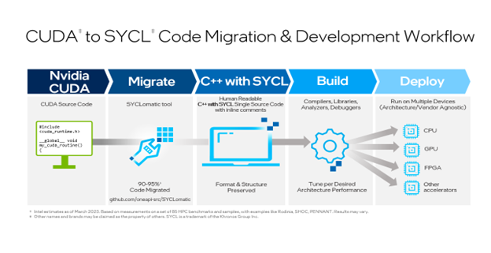

# Run LLM on all Intel GPUs Using llama.cpp

## llama.cpp & ggml Introduction

The open-source project [llama.cpp](https://github.com/ggerganov/llama.cpp) is a light LLM framework and is growing very fast. Its high-performance and customizability have turned the project into a thriving and dynamic community of developers, researchers, and hobbyists. Approximately 1 year since birth, the GitHub project counts more than: 600 contributors, 52,000 stars, 1,500 releases, and 7,400 forks. Thanks to recent code merges, llama.cpp now supports more hardware, including Intel GPUs across server and consumer products. Intel's GPUs join hardware support for CPUs (x86 and ARM) and GPUs from other vendors.

The original implementation of llama.cpp was created by Georgi Gerganov. The project is mainly for educational purposes and serves as the main playground for developing new features for the ggml library, which is a Tensor library for machine learning. With the recent updates, Intel is bringing AI everywhere to more users by enabling AI inference on far more devices. Llama.cpp has good performance due to:

-   Being written in C

-   16-bit float support

-   Integer quantization support (4-bit, 5-bit, 8-bit, etc.)

-   No third-party dependencies

-   Zero memory allocations during runtime

## SYCL Backend for Intel GPUs

There are several backends of ggml to support & optimize for different hardware. Now SYCL backend is added to support all Intel GPUs. We have verified with:

-   Intel® Data Center GPU Max Series

-   Intel® Data Center GPU Flex Series

-   Intel® Arc™ Dicrete GPU

-   Built-in Intel® Arc™ GPU in Intel® Core Ultra CPU

-   iGPU in Intel® 11th Core

With llama.cpp now supporting Intel GPUs, millions of consumer devices are capable of running inference on Llama. Compared to the OpenCL (CLBlast) backend, the SYCL backend has significant performance improvement on Intel GPUs. It also supports more devices, like CPU, and other processors with AI accelerators in the future.

Learn how to use SYCL backend, please refer to guide: [llama.cpp for SYCL](https://github.com/ggerganov/llama.cpp/blob/master/README-sycl.md).

## SYCL and SYCLomatic (Intel® DPC++ Compatibility Tool)

SYCL is a higher-level programming model to improve programming productivity on various hardware accelerators---such as CPUs, GPUs, and FPGAs. It is a single-source embedded domain-specific language based on pure C++17.

oneAPI is a specification that is open and standards-based, supporting multiple architecture types including but not limited to GPU, CPU, and FPGA. The spec has both direct programming and API-based programming paradigms.

Intel uses the SYCL as direct programming language to support CPU, GPUs and FPGAs.

We choose **SYCL** (direct programming language) and **oneMKL** library (high performance BLAS lib on GPU) in oneAPI base toolkit to develop SYCL backend. Because SYCL also supports more GPUs from different vendors, it's possible the SYCL backend supports other GPUs. We will update after verification.

SYCL backend development is very quick: the first running release only takes 3 days of 1 engineer. The secret is we migrate the CUDA (cuBlas backend) to SYCL by a tool named [SYCLomatic](https://github.com/oneapi-src/SYCLomatic). It's a new CUDA-to-SYCL code migration tool (commercial release: [Intel® DPC++ Compatibility Tool](https://www.intel.com/content/www/us/en/developer/tools/oneapi/dpc-compatibility-tool.html) (DPCT))

SYCLomatic assists developers in porting CUDA code to SYCL, typically migrating 90-95% of CUDA code automatically to SYCL code. To finish the process, developers complete the rest of the coding manually and then tune to the desired level of performance for the target architecture (Figure 1 The SYCLomatic workflow).


<p align="center">
  
</p>
<p align="center">
  Figure 1 The SYCLomatic workflow
</p>


The whole project is compiled and executed successfully after update the CMakeLists.txt:

-   LLAMA_SYCL: Parameter to enable SYCL code path.

-   CMAKE_CXX_STANDARD: set to 17.

-   DCMAKE_C_COMPILER: set to icx #Intel C compiler, support C++/SYCL

-   DCMAKE_CXX_COMPILER: set to icpx #Intel C++ compiler support SYCL

-   add_compile_options: add DPCT head files (copied from SYCLomatic)
    path

-   CMAKE_CXX_FLAGS: set for SYCL

-   LLAMA_EXTRA_LIBS: add libs used by SYCL and oneMKL.

After using this tool to create the first working code, we update the code to define new backend by macro GGML_USE_SYCL manually.

The original SYCL code created by SYCLomatic (DPCT) includes many variables/macros/functions defined by SYCLomatic. We copy the used code to ggml-sycl.cpp to reduce the third-party dependencies.

## Run LLM on Intel GPU by SYCL Backend

There is detailed guide in [llama.cpp for SYCL](https://github.com/ggerganov/llama.cpp/blob/master/README-sycl.md).

### Intel GPU

It can run on all Intel GPUs supported by SYCL & oneAPI. The only limitation is **memory**. The iGPU uses the host shared memory. The dGPU uses its own memory.

For Server/Cloud users, you can run on Intel® Data Center GPU Max and Flex Series. They are supported well.

For PC users, you could try on your Intel® Arc GPU or iGPU on Intel Core CPUs. We have tested the iGPUs of 11^th^ Core and newer. The older iGPU could work but with poor performance. We recommend using the iGPU with 80+ EUs (11^th^ Core and newer) and share memory is more than 4.5GB for llama2-7b-Q4 model (Total host memory is 16GB and more, and half memory could be allocated to iGPU).

### Install Intel® GPU Driver

Both Linux & Windows (WLS2) are supported. For Linux, recommend Ubuntu 22.04, which we develop and test on it.

Linux:

1.  [Install Intel GPU
    Drivers](https://dgpu-docs.intel.com/driver/installation.html)

2.  Add user to group: video, render.

```
sudo usermod -aG render username
sudo usermod -aG video username
```

3.  Re-login to enable it.

4.  Check
```
sudo apt install clinfo
sudo clinfo -l
```

Output (example):
```
Platform #0: Intel(R) OpenCL Graphics
 -- Device #0: Intel(R) Arc(TM) A770 Graphics
```
or
```
Platform #0: Intel(R) OpenCL HD Graphics
 -- Device #0: Intel(R) Iris(R) Xe Graphics \[0x9a49\]
```

Windows: [Install Intel GPU Drivers](https://www.intel.com/content/www/us/en/products/docs/discrete-gpus/arc/software/drivers.html).

### Install Intel® oneAPI® Base Toolkit

#### Install

We need to install Intel C/C++/SYCL compiler & oneMKL. Intel® DPC++ Compatibility Tool is **not** installed because we don't need it to migrate code again.

Please follow the procedure in [Get the Intel® oneAPI Base Toolkit](https://www.intel.com/content/www/us/en/developer/tools/oneapi/base-toolkit.html) to install Intel® C/C++/SYCL compiler & oneMKL in oneAPI Base Toolkit.

Recommend installing to default folder. Following guide use the default folder as example. If you use other folder, please modify the following guide info with your folder.

#### Enable oneAPI running time

Before building & running, please enable oneAPI running time.

a.  Linux:

`source /opt/intel/oneapi/setvars.sh`

b.  Windows:

`"C:\Program Files (x86)\Intel\oneAPI\setvars.bat\" intel64`

#### Check

Run：`sycl-ls`

There should be one or more level-zero devices. Please confirm that at least one GPU is present, like **\[ext_oneapi_level_zero:gpu:0\]**.

### Build by One-click

In Linux:

`./examples/sycl/build.sh`

In Windows:

`examples\sycl\win-build-sycl.bat`

Note, the scripts above include the command to enable oneAPI running time.

### Run Example by One-click

Download [llama-2-7b.Q4_0.gguf](https://huggingface.co/TheBloke/Llama-2-7B-GGUF/blob/main/llama-2-7b.Q4_0.gguf) and save to folder **models.**

In Linux:

`./examples/sycl/run-llama2.sh`

In Windows:

`examples\sycl\win-run-llama2.bat`

Note：

1.  The scripts above include the command to enable oneAPI running time.

2.  If the ID of your GPU of Level-zero is not 0, please change the device ID in the script.

To list the device ID:

Linux:

`./build/bin/ls-sycl-device`

Or

`./build/bin/main`

Windows:

`build\bin\ls-sycl-device.exe`

or

`build\bin\main.exe`

## Summary

We created SYCL backend of llama.cpp by migrating CUDA backend by a tool SYCLomatic in short time. After about 2 mouths, SYCL backend has been added more features, like windows building, multiple cards, set main GPU and more OPs. And we update the SYCL backend guide, provide one-click build & run scripts. We hope developers can start their LLM Journey on Intel GPU easily and quickly.

SYCL backend in llama.cpp brings all Intel GPUs to LLM developer and user. Please check if your Intel laptop has iGPU, or your gaming PC has Intel Arc™ GPU, or your cloud VM has Intel Data Center GPU Max & Flex series. If yes, please enjoy the magical features of LLM by llama.cpp on Intel GPUs.

We welcome developers to try and contribute to SYCL backend to add more features and optimization on Intel GPU. It's a good project to learn Intel oneAPI for cross-platform development.

## Reference

[llama.cpp for SYCL](https://github.com/ggerganov/llama.cpp/blob/master/README-sycl.md)

[Intel® oneAPI](https://www.intel.com/content/www/us/en/developer/tools/oneapi/overview.html)

[Data Parallel C++: the oneAPI Implementation of SYCL\*](https://www.intel.com/content/www/us/en/developer/tools/oneapi/data-parallel-c-plus-plus.html#gs.4dwo6d)

[Intel® oneAPI Math Kernel Library (oneMKL)](https://www.intel.com/content/www/us/en/developer/tools/oneapi/onemkl.html#gs.4dzhr4)

[SYCLomatic](https://github.com/oneapi-src/SYCLomatic)

[Intel® DPC++ Compatibility Tool](https://www.intel.com/content/www/us/en/developer/tools/oneapi/dpc-compatibility-tool.html)
